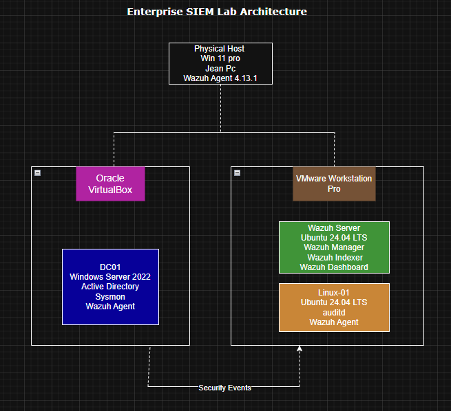
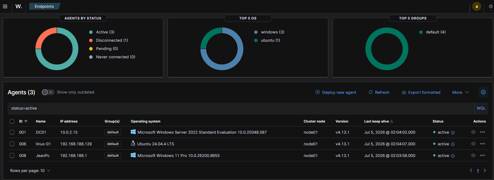
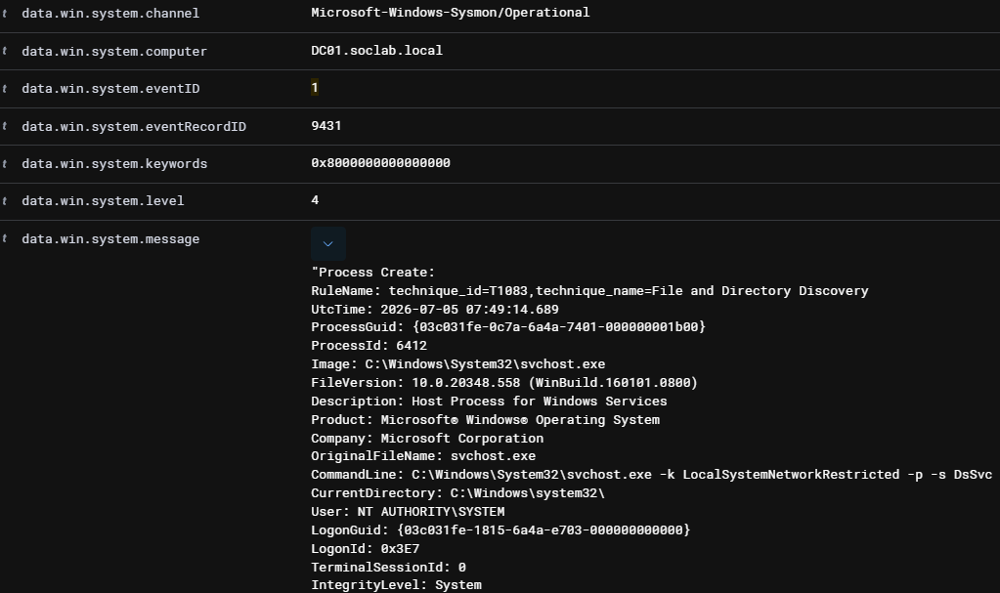
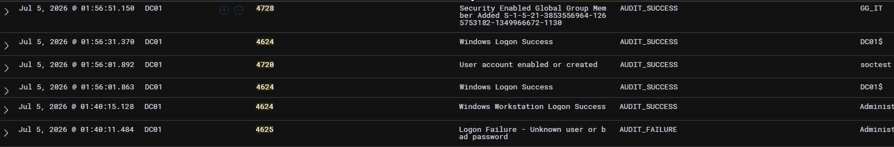
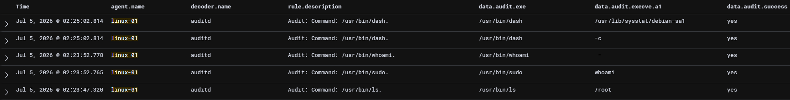

# Enterprise SIEM Lab with Wazuh

## Project Overview

This project demonstrates the deployment of a hybrid Enterprise SIEM
environment using **Wazuh 4.13.1** to monitor Windows and Linux
endpoints from a centralized platform.

The lab combines Microsoft Active Directory, Windows Security Events,
Sysmon, Linux auditd, File Integrity Monitoring (FIM), Security
Configuration Assessment (SCA), PowerShell logging, and MITRE ATT&CK
mapping to simulate a realistic SOC environment.

## Lab Architecture

### Infrastructure

  ------------------------------------------------------------------------
  Host           Operating System                           Role
  -------------- ------------------------------------------ --------------
  JeanPc         Windows 11 Pro                             Management
                                                            Host + Wazuh
                                                            Agent

  DC01           Windows Server 2022                        Active
                                                            Directory
                                                            Domain
                                                            Controller

  linux-01       Ubuntu Server 24.04 LTS                    Linux
                                                            Endpoint +
                                                            auditd

  wazuh-server   Ubuntu Server 24.04 LTS                    Wazuh Manager,
                                                            Indexer and
                                                            Dashboard
  ------------------------------------------------------------------------

## Technologies

-   Wazuh 4.13.1
-   Windows Server 2022
-   Windows 11 Pro
-   Ubuntu Server 24.04 LTS
-   Active Directory Domain Services
-   Sysmon
-   auditd
-   PowerShell
-   MITRE ATT&CK

## Detection Capabilities

### Windows

-   Successful Logon (4624)
-   Failed Logon (4625)
-   User Account Created (4720)
-   User Added to Security Group (4728)
-   Sysmon Process Creation (Event ID 1)
-   File Integrity Monitoring
-   PowerShell Logging

### Linux

-   auditd Monitoring
-   sudo Activity
-   Command Execution
-   User Management
-   File Integrity Monitoring

## MITRE ATT&CK Mapping

  Event               Technique
  ------------------- --------------------------------------------
  4624                T1078 -- Valid Accounts
  4625                T1110 -- Brute Force
  4720                T1136 -- Create Account
  4728                T1098 -- Account Manipulation
  Sysmon Event ID 1   T1059 -- Command and Scripting Interpreter

## Validation Runbook

  Validation                       Result
  -------------------------------- --------
  Agent Connectivity               ✅
  Windows Security Events          ✅
  Sysmon Telemetry                 ✅
  Linux auditd                     ✅
  Active Directory Auditing        ✅
  Successful Logon (4624)          ✅
  Failed Logon (4625)              ✅
  User Account Created (4720)      ✅
  Group Membership Change (4728)   ✅

## Validation Evidence

The following scenarios were successfully generated and validated
through the Wazuh Dashboard:

-   Successful Windows authentication
-   Failed Windows authentication
-   Active Directory user creation
-   Active Directory group membership modification
-   Sysmon process creation
-   Linux auditd command execution
-   Endpoint connectivity validation

## Screenshots

### Connected Wazuh Agents

### Sysmon Process Creation

### Windows Security Monitoring

### Linux auditd Monitoring

## Skills Demonstrated

-   Enterprise SIEM Deployment
-   Wazuh Administration
-   Active Directory Monitoring
-   Windows Event Analysis
-   Linux Security Monitoring
-   Sysmon Configuration
-   auditd Configuration
-   Endpoint Telemetry Collection
-   MITRE ATT&CK Mapping
-   Log Analysis
-   Security Event Correlation
-   Incident Investigation
-   Technical Documentation
-   Troubleshooting

## Lessons Learned

-   Building a SIEM is only the first step; validating telemetry is
    equally important.
-   Sysmon provides significantly richer endpoint visibility than native
    Windows logs alone.
-   Combining Windows and Linux telemetry improves investigation
    capabilities.
-   Accurate documentation and repeatable validation procedures increase
    the value of a security lab.

## Future Improvements

-   Custom Wazuh Detection Rules
-   Sigma Rule Integration
-   Additional Windows and Linux Endpoints
-   Threat Hunting Dashboards
-   Active Response Automation

## Resume Statement

Designed, deployed, and documented a hybrid Enterprise SIEM using Wazuh
4.13.1 integrating Windows Server 2022 Active Directory, Sysmon, Linux
auditd, and centralized security monitoring across multiple endpoints.
Validated authentication events, Active Directory auditing, endpoint
telemetry, and Linux command execution using real-world security
scenarios aligned with the MITRE ATT&CK framework.
